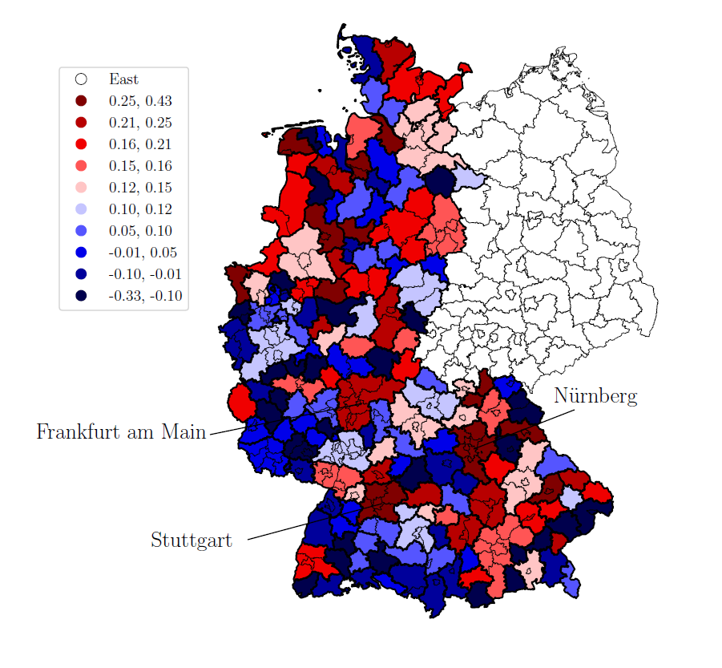

[Home](index.md)  &nbsp; &nbsp;  [Research](research.md)

__The Geography of Assortative Matching__

*Draft available soon!*

> This paper investigates why assortative matching between workers and firms is stronger in large cities than in small cities. I build a search and matching model with heterogeneous workers and firms to study the effect of labor market composition and labor market frictions on labor market sorting. I calibrate the model to match salient moments of the matched employer-employee data from Germany. I find that labor market efficiency plays a major role in explaining differences in assortative matching across cities. Moreover, its effect is amplified by a more disperse workers productivity distribution, since there are higher returns from matching with similar types for both workers and firms. Using the calibrated version of the model, I show that around 5% of GDP gap observed between large and small cities can be explained by differences in assortative matching. Overall, the paper stresses the importance of studying local labor market frictions and workers productivity distribution together to understand why the allocation between heterogeneous workers and firms vary between cities, and the resulting implications for spatial inequalities.

**Presented at**: <small> QMUL Macro Internal Seminar (2024), NSE 3rd PhD and Post-Doctoral Workshop in Economics and Finance (2024), 22nd edition Brucchi Luchino Workshop in Labor Economics (2024) _(selected)_</small>

<figure>
  
  <figcaption> <em>Degree of Assortative Matching across local labor markets in West Germany (2010 - 2017)</em> </figcaption>
  

</figure>

___

__Task-Biased Technological Change Across Countries__  *with Paula Cesana*
